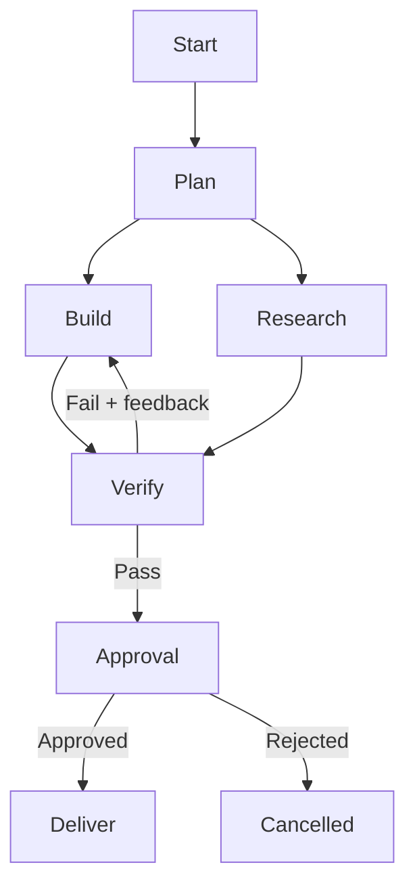

# Graph — Controlled AI Workflow Design

## Overview

Use this skill to turn “give an agent a goal and let it keep trying” into an inspectable workflow of explicit steps, decisions, parallel branches, retry paths, approval gates, and stop conditions.

The governing idea is:

> **Graph outside. Loops inside.** Software governs where a job may go; AI handles judgment inside the steps that need it.

A graph does **not** eliminate loops. A graph contains and bounds them. For example, `Generate → Evaluate → Revise → Evaluate` is a loop represented by a cycle in the graph. The graph adds a shared state record, success criteria, retry limits, escalation, persistence, and visibility.

Unless the user explicitly says otherwise, “graph” here means a **workflow graph / state machine**, not a knowledge graph, chart, database graph, or GraphRAG system.

## When to Use

Use `/graph` when a workflow has one or more of these properties:

- Multiple specialist agents, tools, services, or humans.
- Conditional paths such as pass/fail, cheap/expensive, safe/risky, or known/unknown.
- Work that can run in parallel and later merge.
- Evaluator–optimizer cycles, retries, or repair loops.
- Long-running work that must resume after interruption.
- External side effects requiring approval, idempotency, or rollback.
- Recurring crons, operational pipelines, engineering factories, or client-facing automations.
- A free-running agent loop that is expensive, brittle, hard to debug, or difficult to trust.

Do **not** reach for a graph automatically when:

- A single model/tool call solves the task.
- One short agent loop has an obvious stop condition and low downside.
- The task is exploratory and its useful path cannot yet be predicted.
- The proposed graph adds boxes without adding control, observability, safety, reuse, or reliability.
- The user means a knowledge graph, data visualization, mathematical graph, or GraphRAG.

## Invocation Contract

When invoked with a workflow description, treat it as the target system to design or review.

When invoked without arguments:

1. Infer the target process from the active task or recent conversation.
2. If one obvious process exists, graph it immediately.
3. If several materially different processes exist, ask one focused clarification question rather than inventing scope.

Do not merely explain graph theory. Produce an operational workflow artifact.

## Mental Model

Every production workflow graph needs these parts:

| Part | Plain-English meaning | Required question |
|---|---|---|
| **Outcome** | The verifiable finish line | What observable result counts as done? |
| **State** | The shared job folder | What facts, artifacts, decisions, attempts, costs, and approvals must survive between steps? |
| **Nodes** | The boxes that do work | What is each step’s owner, input, output, success condition, and failure result? |
| **Edges** | The arrows between boxes | What fixed rule or condition chooses the next step? |
| **Cycles** | Controlled loops | What is retried, with what feedback, and how many times before escalation? |
| **Gates** | Permission boundaries | What requires tests, policy checks, budget checks, or human approval? |
| **Terminal states** | Explicit endings | What are success, safe failure, cancellation, and escalation? |

A node may contain deterministic code, an LLM call, a tool, a specialist agent, a human task, or a subgraph. Do not make something an “agent” when ordinary code is more reliable.

## Workflow

### 1. Define the outcome and loss function

Write one sentence describing the desired result and a short acceptance checklist. Define what “better,” “acceptable,” and “failed” mean before choosing agents or frameworks.

Capture:

- Required artifacts.
- Objective checks such as tests, schema validation, production verification, or source coverage.
- Quality checks requiring an evaluator or human judgment.
- Forbidden outcomes and blast-radius limits.
- Budget, latency, and retry ceilings.

**Completion criterion:** a verifier can decide success or failure without asking the worker that produced the result.

### 2. Define the shared state

Create the smallest durable state schema that lets every node resume and make decisions without rereading an entire conversation.

Typical fields:

```yaml
job_id: string
status: queued|running|blocked|failed|completed|cancelled
objective: string
inputs: {}
artifacts: []
decisions: []
attempts: {}
validation_results: []
approvals: []
cost: {}
errors: []
next_node: string|null
```

Store artifacts by path, URL, ID, or hash rather than stuffing giant outputs into state. Keep immutable source evidence separate from synthesized summaries.

**Completion criterion:** execution can stop after any node and resume from persisted state without guessing what already happened.

### 3. Identify nodes by contracts, not job titles

For each node, define:

```text
Node name:
Purpose:
Owner: deterministic code | model | specialist agent | human
Inputs:
Outputs:
Allowed tools/permissions:
Success condition:
Failure output:
Timeout:
Maximum attempts:
Idempotency key or duplicate-prevention rule:
```

Prefer deterministic code for validation, routing, calculations, file synchronization, and policy enforcement. Use models for ambiguity, synthesis, classification, planning, critique, or creative judgment.

**Completion criterion:** every node has a bounded responsibility and a machine- or human-checkable output contract.

### 4. Connect nodes with explicit edges

Use four edge types deliberately:

1. **Fixed:** always go to the next node.
2. **Conditional:** route from structured state such as `tests_passed`, `risk_level`, or `needs_approval`.
3. **Parallel:** fan out independent work, then fan in at an aggregator or verifier.
4. **Cyclic:** return to a prior node with feedback and a retry budget.

Prefer routing from structured outputs or deterministic checks. Do not ask a model “what next?” when ordinary logic can safely decide.

**Completion criterion:** every node has a defined next state for success, recoverable failure, unrecoverable failure, cancellation, and timeout.

### 5. Put loops inside guardrails

For each cycle, specify:

- What new evidence or feedback makes the next attempt different.
- Maximum attempts or spend.
- Whether the worker changes on retry.
- What gets preserved across attempts.
- The escalation or safe-failure destination.

A valid evaluator–optimizer cycle looks like:

```text
Generate → Independent evaluator
              ├─ accepted → Continue
              └─ rejected + specific feedback → Revise
                                                └→ Evaluator
```

A naked `while not done: ask_model_again()` is not a production control strategy.

**Completion criterion:** no cycle can run indefinitely, repeat without new feedback, or hide its cumulative cost.

### 6. Add governance and recovery

Place gates before consequential side effects:

- Sending messages or publishing.
- Charging money or making purchases.
- Deploying to production.
- Deleting or overwriting data.
- Changing permissions, credentials, or infrastructure.
- Acting on low-confidence research.

Add:

- Checkpoints after expensive or irreversible steps.
- Idempotency for retries.
- Least-privilege permissions per node.
- Timeouts and circuit breakers.
- Rollback or compensation steps.
- Human approval with a concise decision packet.
- Logs containing node, input references, output references, duration, cost, and reason for routing.

**Completion criterion:** every external side effect has an owner, permission boundary, duplicate-prevention rule, and recovery path.

### 7. Choose the lightest implementation that works

Do not prescribe LangGraph merely because the artifact is a graph.

Use plain functions, scripts, cron, a database row, state JSON, Kanban stages, or a queue when the workflow is small and stable. Reach for LangGraph, Temporal, Inngest, durable execution, or another orchestration framework when persistence, concurrency, replay, interrupts, dynamic routing, or operational tooling justify it.

Implementation ladder:

1. **Diagram only:** clarify a one-off process.
2. **Explicit functions + state:** small local automation.
3. **Queue/cron/Kanban + persisted state:** recurring operational workflow.
4. **Durable workflow engine:** long-running, concurrent, high-value, or failure-sensitive system.
5. **Dynamic graph generation:** only when task shape truly cannot be known in advance and generated routes are still validated against policy.

**Completion criterion:** the selected machinery is no heavier than the reliability requirements demand.

### 8. Produce the graph artifact

Return these sections unless the user requests another format:

#### A. Recommendation

State whether the process should remain a simple loop, become a graph, or use a hybrid graph-with-loops design. Give the decisive reason.

#### B. Workflow diagram

Prefer Mermaid when useful, with an ASCII fallback for chat surfaces that do not render Mermaid.



#### C. Node contracts

Provide a table listing owner, input, output, success test, failure route, and retry limit.

#### D. State schema

Show the minimum persistent fields and where artifacts live.

#### E. Guards and failure paths

List approvals, permissions, budgets, timeouts, idempotency, rollback, and terminal states.

#### F. Implementation plan

Name the smallest practical implementation and give concrete build steps. If reviewing an existing system, identify the first graph edge or state transition to change.

**Completion criterion:** another engineer or agent can implement the workflow without inventing missing control flow.

### 9. Compile the diagram into a tracer bullet

A graph is not implemented because its boxes look sensible. Convert one narrow path into executable code before building every branch.

1. Draw or provide the graph and state schema.
2. Ask the coding agent to implement the workflow as code against one real input, including node contracts, routing conditions, persisted state, retry caps, and terminal states.
3. Run the script or workflow; do not accept generated code without execution.
4. Inspect the trace: node order, branch choices, artifacts, failures, retries, cost, and final verifier output.
5. Expand only after the tracer path passes.

Reusable handoff:

```text
Implement this workflow graph as the lightest executable system that satisfies its contracts. Use the supplied state schema and one real input. Keep deterministic routing in code. Persist node outputs by artifact reference. Add retry/spawn caps, explicit failure states, and an independent verifier. Run it, return the execution trace, and fix it until the acceptance checks pass.
```

Before parallelizing, delete **fake edges**: if node B does not consume node A's output, B should not wait for A. Conversely, keep one agent when every step needs the full prior context. A graph buys breadth and control; it does not automatically improve judgment.

**Completion criterion:** one real input traverses the intended path, the trace matches the diagram, and the verifier checks the resulting artifact rather than the worker's self-report.

## Reusable Patterns

### Router

Classify once, then send the job to the appropriate specialist path. Use structured labels and a fallback route.

### Parallel fan-out / fan-in

Run independent research, implementation, or evaluation nodes simultaneously; merge only after all required outputs arrive or explicitly time out.

### Orchestrator–worker

A planner creates bounded work items; workers return artifacts; the orchestrator tracks coverage and sends outputs to independent verification. Do not let the orchestrator silently perform missing worker tasks without recording the fallback.

### Evaluator–optimizer

One node generates, another independently checks against explicit criteria, and a conditional edge either accepts or returns actionable feedback. Cap the cycle.

### Human approval gate

Pause with a decision packet containing proposed action, evidence, risk, cost, and rollback. Resume from persisted state after approval or rejection.

### Saga / compensation

For multi-step side effects, define a compensating action for each completed step when a later step fails and full rollback is impossible.

## Common Pitfalls

1. **False dichotomy.** Graphs do not kill loops; useful loops become explicit cycles inside graphs.
2. **Graph theatre.** More boxes do not create reliability. Every node must add a contract, control boundary, reusable specialization, observability, or parallelism.
3. **Agent everywhere.** Deterministic routing and validation should remain code where possible.
4. **One giant shared transcript.** Persist compact state and artifact references instead of passing an ever-growing chat to every node.
5. **Model-controlled safety.** Do not let the same model both perform and approve a consequential action.
6. **Unbounded evaluator loops.** Every rejection must produce actionable feedback and consume a visible retry budget.
7. **No failure graph.** The happy path is only half the system. Model timeouts, tool errors, partial writes, duplicate retries, cancellation, and human rejection.
8. **Fake edges.** Do not serialize independent work merely because the steps were described with "and then." An arrow is real only when the downstream node consumes upstream state.
9. **Graph means smarter.** Parallel agents buy coverage; independent verification and better evidence buy judgment.
10. **Parallel write collisions.** Give each worker a distinct artifact or file; merge through one fan-in owner.
11. **Premature framework adoption.** A five-node workflow may need plain code, not a distributed orchestration platform.
12. **Dynamic-graph hype.** Letting an agent invent arbitrary nodes and permissions recreates the uncontrolled loop at a more fashionable abstraction layer.
13. **No production proof.** A successful node response is not proof that the side effect occurred; read back files, query the API, run tests, or inspect production.

## Verification Checklist

Before calling the graph complete:

- [ ] Outcome and independent acceptance criteria are explicit.
- [ ] Shared state is minimal, persistent, and sufficient to resume.
- [ ] Every node has owner, inputs, outputs, permissions, timeout, and success condition.
- [ ] Every edge is fixed, conditional, parallel, or cyclic with a stated rule.
- [ ] Every cycle has new feedback, a retry/cost cap, and escalation.
- [ ] External side effects have approval, idempotency, and recovery where appropriate.
- [ ] Success, safe failure, cancellation, timeout, and escalation are terminal or routed states.
- [ ] The diagram matches the node-contract table and implementation plan.
- [ ] Deterministic code handles deterministic decisions.
- [ ] The implementation uses the lightest viable orchestration machinery.
- [ ] The finished workflow has a real verification strategy, not an agent’s self-report.

## Sources

- Peter Steinberger, “Are we still talking loops or did we shift to graphs yet?” — https://x.com/steipete/status/2078277297791189132
- Graph-to-code workflow prompt — https://x.com/steipete/status/2080779917130858598
- Graph engineering course: fake edges, diamond fan-out/fan-in, stop rules, and human gates — https://x.com/EXM7777/status/2079934660982047021
- LangGraph Graph API overview — https://docs.langchain.com/oss/python/langgraph/graph-api
- LangGraph workflow patterns — https://docs.langchain.com/oss/python/langgraph/workflows-agents
