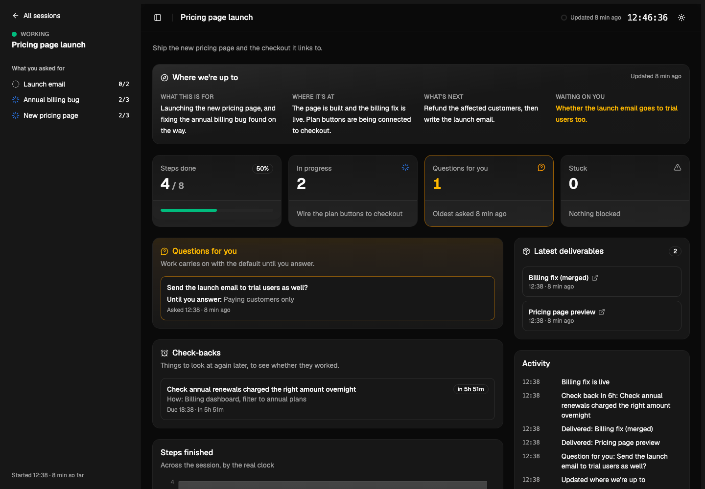

# session-telemetry



Run ten agent sessions at once and you lose the thread of every one of them. This gives each long session one live page that answers "where are we up to?" in about five seconds.

- **Where we're up to:** what the session is for, where it's at, what's next, and what's waiting on you.
- **Work, grouped by what you asked for:** every step, its status and how long it took.
- **Questions for you,** each showing what the agent is doing until you answer. It never stops to wait.
- **Deliverables, stuck items, and check-backs** ("look again in 6 hours to see if the deploy worked"), which go amber when they're due.
- **All sessions on one home page.** It updates live, and every time on it comes from the machine's clock, never typed by the agent.

It's a small always-on local server (`localhost:4200`, this machine only, no accounts) with a React and shadcn front end, dark by default. Agents write to it through one command-line updater, and an optional builder agent sets up each session's page in the background so the main agent never waits.

## Install

Needs Node 20+ on macOS or Linux.

```bash
git clone https://github.com/rs9io/skills
cd skills/session-telemetry
./install.sh
```

The installer:

- builds the app and copies it to `~/.session-telemetry`
- starts the server on login and restarts it if it stops (launchd on macOS, systemd on Linux)
- adds the `telemetry-builder` agent to `~/.claude/agents`

Then add the skill to your agent:

```bash
cp -R ../session-telemetry ~/.claude/skills/session-telemetry     # Claude Code
cp -R ../session-telemetry ~/.codex/skills/session-telemetry      # Codex
cp -R ../session-telemetry ~/.cursor/skills/session-telemetry     # Cursor
```

Open http://localhost:4200.

To make it the default for every session, add one line to your `~/.claude/CLAUDE.md` (or `AGENTS.md`):

```md
Any session with more than 5 steps or over 30 minutes of work gets a live dashboard: follow the session-telemetry skill.
```

Options: `./install.sh --no-service` (start it yourself with `node ~/.session-telemetry/server.mjs`) and `--no-agent`. You can change the folder and port with `TELEMETRY_HOME` and `TELEMETRY_PORT`.

## How it works

```
agent ──> node ~/.session-telemetry/dash.mjs task t3 done
             │  writes data/<session>.json, stamps the real clock
             ▼
server.mjs ──> sees the change, pushes it to every open page
             ▼
localhost:4200/s/<session>  updates on the spot (and re-checks every 10 s as a backup)
```

- **`dash.mjs`** is the only writer. It writes a structured file per session, atomically.
- **`server.mjs`** is the server, with no dependencies. It listens on `127.0.0.1` only and pushes changes live.
- **The builder agent** (Opus, medium effort, with its own memory) starts each session's page. A hook (`guard.mjs`) fences it in: it can run only the updater, open the page and check the date, it can read only `~/.session-telemetry`, and it can write only its own memory.
- **Check-backs** outlive the turn. Anything that writes through the updater later (a scheduled job, a reply to an email) shows up live.

## Uninstall

```bash
./uninstall.sh            # keeps your session history
./uninstall.sh --purge    # removes everything
```

MIT. From the [RS9](https://rs9.io) skills shelf.
